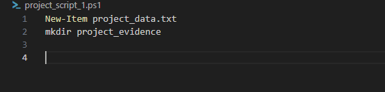
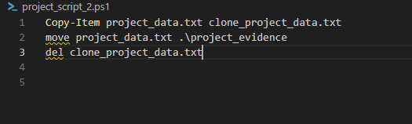
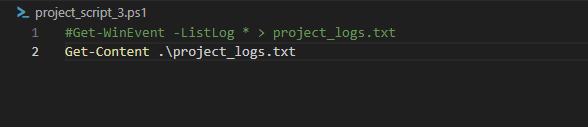
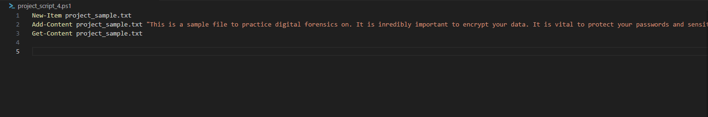
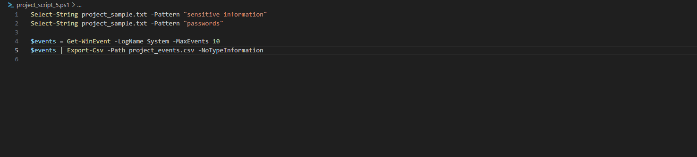
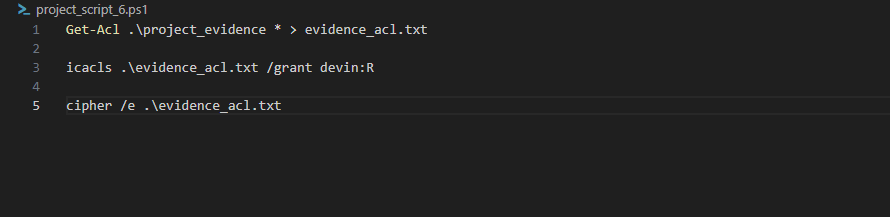

# df-mod3-sdm

# PowerShell File and Folder Management / Scripting

### Commands Executed

- Created a new file named project_data.txt
- Created a new directory named 'project_evidence'
- Went back a directory level to the df-mod3-sdm folder
- listed the contents of the current directory using 'dir' command
- listed the contents of the current directory using the 'ls' command
- wrote a script to copy project_data.txt and move it to the project_evidence folder
- deleted backup.txt within the script as well ("del")

### Scripts for both project_script_1 and project_script_2

### Commands Executed

- Created the script project_script_3.ps1, which retrieved all events from the Windows event log and saved them to 'project_logs.txt'
- Verified the creation of 'project_logs.txt' and listed its contents within the same script bu using the "Get-Content" command
- Created a script called project_script_4.ps1 which created a new text file 'project_sample.txt' w/sample content
- Retrieved the contents of 'project_sample.txt'
- Wrote script project_script_5.ps1 to search for specific text within 'project_sample.txt' and then exported the contents to a csv file
- Exported data to a CSV file 'project_events.csv'
- Wrote script project_script_6.ps1 which retrieved the acl of the project_evidence folder and redirected it to "evidence_acl.txt", granted only "read" permissions to that file, and encrypted that file

# Scripts for project_script_(3, 4, 5, & 6)

